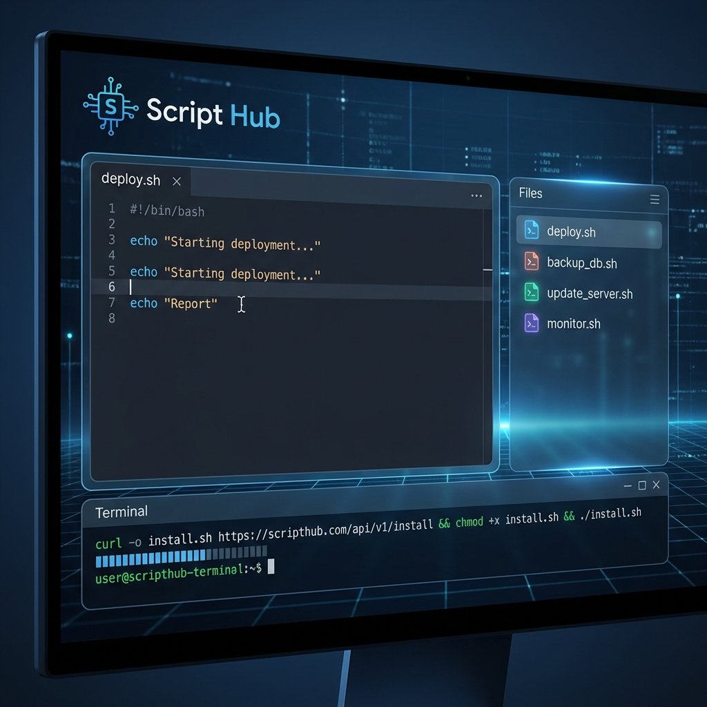
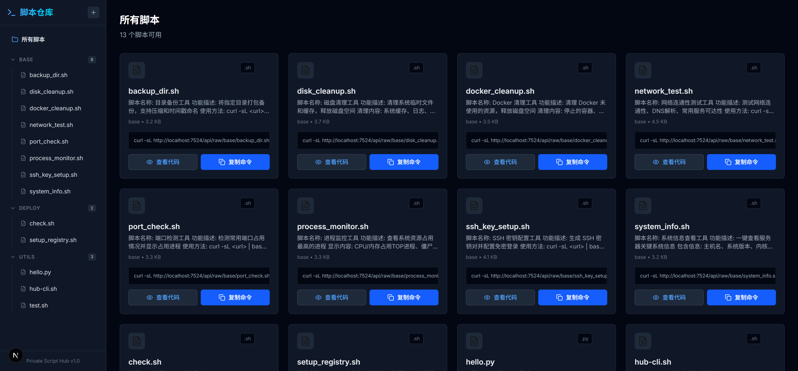
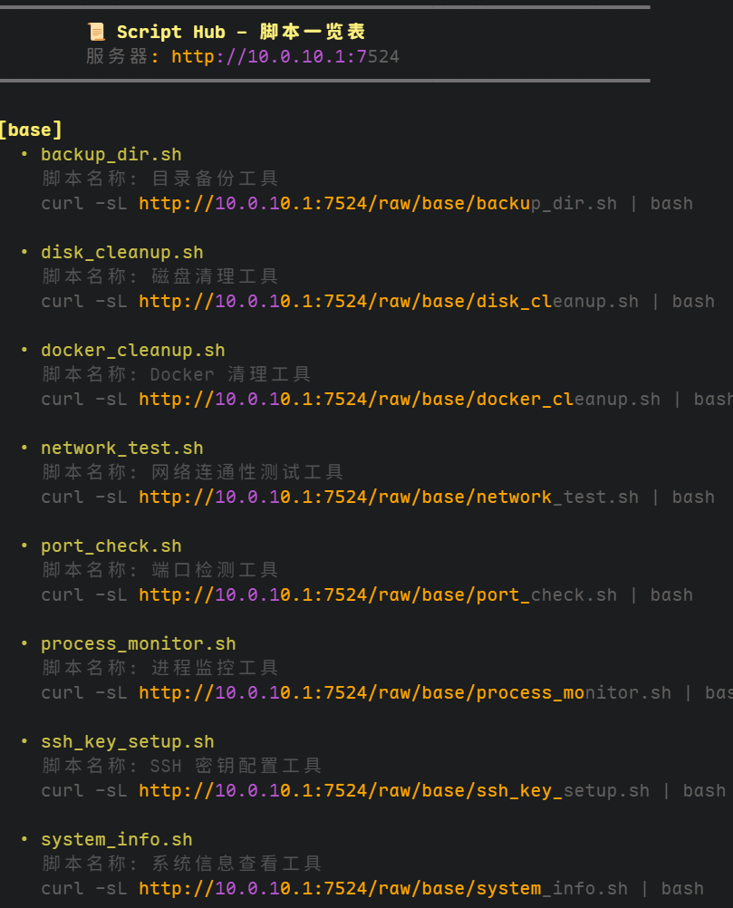

# 📜 Script Hub - 私人脚本仓库




Script Hub 是一个轻量级的、自托管的脚本管理平台。你可以通过 Web 界面上传、编辑和管理常用的 Shell、Python 或其他任何类型的脚本，并能通过极简的命令行一键在远程服务器上执行。

---

## ✨ 核心特性

- 📂 **分类管理**：支持按文件夹自动分类管理脚本。
- 🖥️ **全能 CLI**：通过一行命令即可在任何机器上列出并运行仓库中的脚本。
- 🔐 **安全访问**：内置简单的账号密码认证，保护你的私有脚本安全。
- 🎨 **极简 UI**：现代化的深色模式设计，流畅的交互体验。
- 🌐 **多语言支持**：原生支持中文环境。
- 📦 **Docker 部署**：一键部署，开箱即用。

---

## 🚀 快速开始

### Docker 部署 (推荐)

1. 克隆/下载本项目。
2. 修改 `docker-compose.yml` 中的环境变量：
   - `ENV_USER`: 登录用户名 (默认: admin)
   - `ENV_PASSWORD`: 登录密码 (默认: 123456)
3. 启动：
   ```bash
   docker-compose up -d
   ```
4. 访问：`http://your-server-ip:7524`

---

## 🖥️ 命令行客户端 (CLI) 使用

这是 Script Hub 最强大的功能。你不需要登录 Web，直接在任何 Linux 终端输入以下命令：

### 1. 获取所有脚本清单
```bash
curl -sL http://your-server-ip:7524/script | bash
```

### 2. 运行脚本
运行上述命令后，终端会打印出所有可用的脚本及其对应的执行命令。例如：
```text
[base]
 • backup_db.sh
   自动备份数据库脚本
   curl -sL http://your-server-ip:7524/raw/base/backup_db.sh | bash
```
你只需要**复制并粘贴**蓝色显示的 `curl ... | bash` 命令即可立即执行。

---

## 📖 管理员手册

### 如何添加脚本
1. **Web 界面**：点击侧边栏的 `+` 号，可以直接在线编写脚本或上传本地文件。
2. **文件系统**：直接将脚本文件放入服务器的 `data/scripts/` 目录下。
   - 根目录下为“未分类”。
   - 子文件夹名即为分类名。

### 脚本说明规范
在脚本的前几行使用 `#` 或 `//` 编写注释，系统会自动提取并显示为脚本描述：
```bash
#!/bin/bash
# 自动清理系统日志
# 适用环境：Ubuntu/CentOS
# ...
```

---

## 🛠️ 开发者指南

### 本地开发
```bash
# 安装依赖
yarn install

# 启动开发服务器
npm run dev
```

### 生产构建
```bash
npm run build
npm start
```

---

## 📝 默认配置
- **端口**: 7524
- **默认用户**: `admin`
- **默认密码**: `123456`

---

## 📅 版本记录
- **v1.0** (2026-01-29)
  - 核心 Web 管理功能上线。
  - 推出极简非交互式 CLI 一键清单功能。
  - 修复局域网 IP 访问下的复制报错问题。
  - 优化移动端及非安全上下文兼容性。

---

## 📸 系统截图

#### Web 登录界面


#### 主控制面板 (Dashboard)


#### 添加脚本页面


#### 命令行执行效果


*更多功能正在开发中...*

---

*由 [Antigravity](https://github.com/google/antigravity) 驱动开发*
